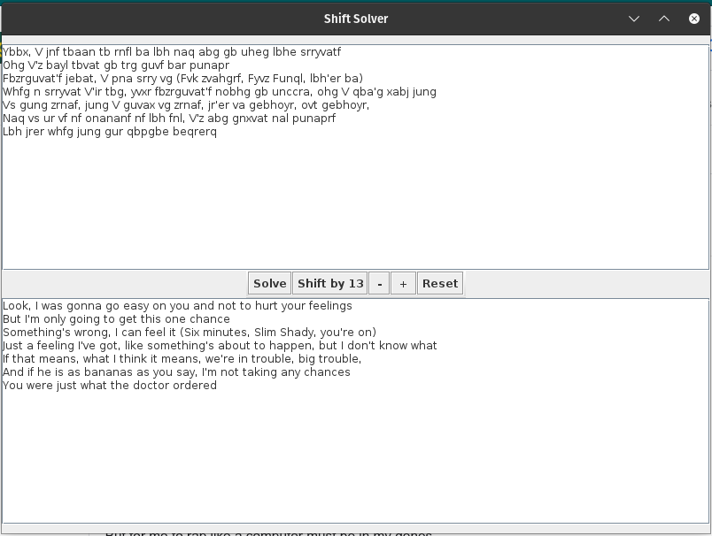

# Ceaser-solver
A Java Swing GUI that can encode/decode substitution ciphers

- This program can decode/encode ciphers of the shift-by-N sort.
- Works best with a large number of words 
- Written in Eclipse

